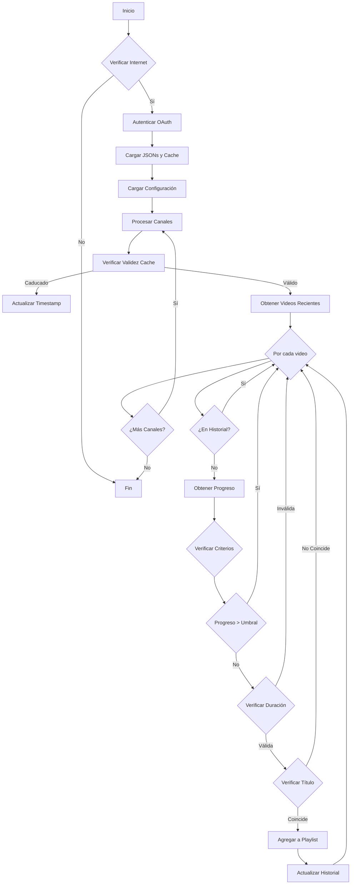

# YouTubeAutoList

## Genera una lista automáticamente

### Diagrama de flujo

### Archivo de configuracion

'''json
{
"playlist*id": "ID Lista",
"channels": [
{
"channel_id": "ID Canal",
"channel_name": "Nombre Canal",
"title_pattern": "([a-zA-Z0-9*-]+)",
"min*duration": 120,
"max_duration": 900,
"hours_limit": 6
},
{
"channel_id": "ID Canal",
"channel_name": "Nombre Canal",
"title_pattern": "([a-zA-Z0-9*-]+)",
"min*duration": 120,
"max_duration": 900,
"hours_limit": 6
},
{
"channel_id": "UCuCeID Canal",
"channel_name": "Nombre Canal",
"title_pattern": "([a-zA-Z0-9*-]+)",
"min_duration": 120,
"max_duration": 900,
"hours_limit": 6
},
]
}
'''