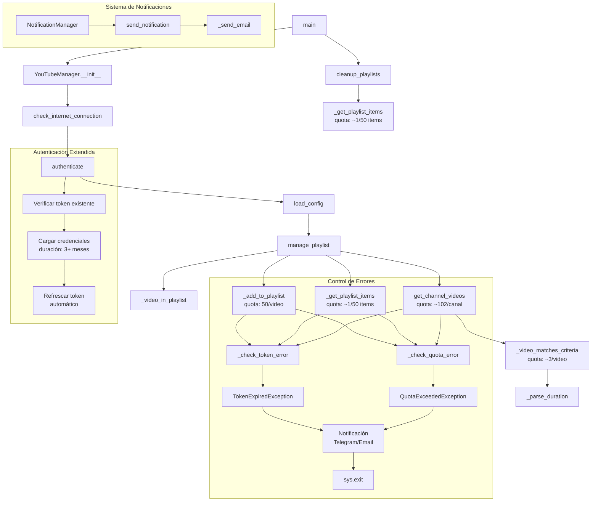

# YouTubeAutoList


[](https://github.com/hfsotomayor/YouTubeAutoList/releases)
[](https://github.com/hfsotomayor/YouTubeAutoList/issues)
[](https://github.com/hfsotomayor/YouTubeAutoList/pulls)
[](https://github.com/hfsotomayor/YouTubeAutoList/blob/main/LICENSE)

Sistema automatizado para gestionar listas de reproducción de YouTube basado en criterios configurables.

## Requisitos Previos

1. Python 3.11 o superior
2. Docker (opcional)
3.  Credenciales de YouTube API
4. Cuenta de Google y proyecto en Google Cloud Platform

## Configuración de Google Cloud Platform

1. Crear un nuevo proyecto en [Google Cloud Console](https://console.cloud.google.com/)
2. Habilitar YouTube Data API v3:
   - Ir a "APIs & Services" > "Library"
   - Buscar "YouTube Data API v3"
   - Clic en "Enable"

3. Configurar credenciales OAuth:
   - Ir a "APIs & Services" > "Credentials"
   - Clic en "Create Credentials" > "OAuth client ID"
   - Seleccionar "Desktop Application"
   - Configurar pantalla de consentimiento:
     * Tipo de usuario: Externo
     * Información de la aplicación
     * Permisos: `.../auth/youtube.force-ssl`
   - Descargar el archivo JSON de credenciales y renombrarlo a `YouTubeAutoListClientSecret.json`

## Configuración de Autenticación

1. **Revocar accesos previos** (importante para obtener refresh_token):
   - Ir a https://myaccount.google.com/permissions
   - Buscar "YouTubeAutoList"
   - Revocar acceso existente

2. **Generar nuevo token**:
```bash
python auth_setup.py
```

3. **Verificar el token generado**:
```bash
ls -l YouTubeAutoListToken.json
cat YouTubeAutoListToken.json | grep refresh_token
```

## Características Principales

- Sistema híbrido RSS/API para máxima eficiencia
- Autenticación OAuth 2.0 con YouTube API (3+ meses)
- Sistema de base de datos SQLite para persistencia y seguimiento
- Sistema de caché avanzado multinivel (RSS y API)
- Sistema inteligente de gestión de cuota de YouTube API
- Sistema de notificaciones (Telegram/Email)
- Filtrado de videos por duración y patrones en títulos
- Detección y exclusión automática de Shorts
- Limpieza automática de videos antiguos
- Sistema de respaldo automático de datos y configuraciones
- Soporte para múltiples canales y listas de reproducción
- Contenedorización con Docker y persistencia de datos

## Estructura

```
YouTubeAutoList/
├── YouTubeAutoList.py       # Script principal
├── auth_setup.py           # Script de autenticación inicial
├── database_manager.py     # Gestor de base de datos SQLite
├── rss_manager.py         # Gestor de feeds RSS
├── entrypoint.sh          # Punto de entrada para Docker
├── Dockerfile             # Configuración de Docker
├── requirements.txt       # Dependencias Python
├── db_schema.sql         # Esquema de la base de datos
├── YouTubeAutoListConfig.json    # Configuración de canales
├── YouTubeAutoListToken.json     # Token de autenticación
├── YouTubeAutoListNotification_config.json # Notificaciones
├── YouTubeAutoListClientSecret.json  # Credenciales de Google Cloud
└── persistent_data/      # Datos persistentes
    ├── db/              # Base de datos SQLite
    └── logs/            # Logs del sistema
```

## Diagrama de Flujo 



### Consumo de Cuota y Optimización

El sistema utiliza un enfoque híbrido RSS/API para maximizar la eficiencia:

1. **Detección Inicial vía RSS**:
   - Obtención de videos nuevos sin consumo de cuota
   - Filtrado inicial por títulos y fecha
   - Caché de feeds RSS por 1 hora
   - Sin límites de cuota API

2. **Consumo de Cuota API**:
Solo se usa la API para:
   - Detalles de videos: 1-2 unidades por video (en lotes de 50)
   - Verificación de playlist: 1 unidad por 50 videos
   - Agregar video: 50 unidades por video
   - Eliminar video: 50 unidades por video

3. **Sistema de Caché Multinivel**:
   - RSS: Detección inicial y metadatos básicos
   - SQLite: Almacenamiento persistente de metadatos
   - Caché en memoria: Resultados frecuentes
   - Sistema de invalidación inteligente

2. **Optimización de Llamadas**:
   - Procesamiento en lotes de videos (hasta 50 por llamada)
   - Verificación previa en caché antes de consultas
   - Reutilización de datos entre sesiones

3. **Gestión de Cuota**:
   - Monitoreo continuo del consumo de cuota
   - Notificaciones automáticas al alcanzar límites
   - Parada segura ante exceso de cuota
   - Estadísticas detalladas de uso

El sistema híbrido reduce el consumo total de cuota en aproximadamente un 95% mediante:
- Detección inicial vía RSS sin consumo de cuota
- Base de datos persistente para metadatos
- Procesamiento en lotes eficiente
- Caché multinivel (RSS, memoria y base de datos)
- Invalidación selectiva de caché

**Ventajas del Sistema Híbrido**:
1. **Menor Consumo de Cuota**:
   - RSS para detección inicial sin cuota
   - API solo para detalles específicos
   - Reducción drástica de llamadas a la API

2. **Mayor Velocidad**:
   - RSS permite detección instantánea
   - Sin esperas por límites de cuota
   - Respuesta más rápida a nuevos videos

3. **Mayor Robustez**:
   - Funciona incluso con cuota agotada
   - Redundancia en fuentes de datos
   - Recuperación automática

**Nota**: La cuota diaria gratuita de YouTube API v3 es de 10,000 unidades.

## Configuración

### Archivo YouTubeAutoListConfig.json

```json
{
    "channels": [
        {
            "channel_id": "ID_CANAL",
            "channel_name": "Nombre Canal",
            "playlist_id": "ID_PLAYLIST",
            "playlist_name": "Nombre Playlist",
            "title_pattern": "regex_pattern",
            "min_duration": 120,
            "max_duration": 900,
            "hours_limit": 8
        }
    ]
}
```
### Archivo YouTubeAutoListNotification_config.json

```json
{
    "telegram_token": "YOUR_BOT_TOKEN",
    "telegram_chat_id": "YOUR_CHAT_ID",
    "email": {
        "smtp_server": "smtp.gmail.com",
        "username": "your-email@gmail.com",
        "password": "your-app-password",
        "from": "your-email@gmail.com",
        "to": "notification-email@domain.com"
    }
}
```

## Expresiones Regulares en Configuración

Los patrones de búsqueda soportan:

1. **Palabras exactas**:
```json
"title_pattern": "(?i)(\\b(IA|AI|cars)\\b)"
```

2. **Palabras con sufijos**:
```json
"title_pattern": "\\b(bike|gravel|mtb)\\w*"
```

3. **Patrones específicos por canal**:
```json
{
    "channel_name": "Bike Sport",
    "title_pattern": "(?i)((Latest news bulletin.*Evening)|\\b(Gravel|MTB)\\b)"
}
```

4. **Formatos de fecha/hora**:
```json
{
    "channel_name": "TOUR FRANCE",
    "title_pattern": "(?i)(Noticias del \\d{4}/\\d{2}/\\d{2} 20h00)"
}
```

### Variables de Entorno Docker

```yaml
environment:
  - TZ=Europe/Madrid
  - CONFIG_DIR=/app/config
  - LOG_DIR=/app/logs
  - DATA_DIR=/app/data
```

## Uso

### Local

1. Instalar dependencias:
```bash
pip install -r requirements.txt
```

2. Inicializar base de datos:
```bash
sqlite3 YouTubeAutoList.db < db_schema.sql
```

3. Ejecutar:
```bash
python YouTubeAutoList.py
```

### Docker 

El sistema incluye un script de despliegue automatizado que maneja:
- Respaldo de datos existentes
- Verificación de integridad de la base de datos
- Actualización de esquemas
- Gestión de permisos
- Persistencia de datos

1. Ejecutar script de despliegue:
```bash
./deply_youtubeautolist.sh
```

El script solicitará la versión de la imagen y se encargará de:
- Crear estructura de directorios persistentes
- Respaldar datos del contenedor existente
- Construir nueva imagen
- Actualizar contenedor
- Restaurar datos persistentes
- Verificar permisos

## Logging

Los logs se guardan en:
- `logs/YouTubeAutoList.log`: Logs de la aplicación
- `logs/cron.log`: Logs de las ejecuciones programadas

## Commits Convencionales

Este proyecto sigue la especificación de [Commits Convencionales](https://www.conventionalcommits.org/es/v1.0.0/).

### Estructura del Commit

#### Tipos de Commits
- `feat`: Nueva característica
- `fix`: Corrección de errores
- `docs`: Cambios en documentación
- `style`: Cambios de formato (espacios, punto y coma, etc)
- `refactor`: Refactorización de código
- `perf`: Mejoras de rendimiento
- `test`: Añadir o modificar tests
- `build`: Cambios en el sistema de build
- `ci`: Cambios en integración continua
- `chore`: Tareas de mantenimiento

#### Ejemplos
```bash
feat(auth): implementar autenticación OAuth
fix(cache): corregir error en expiración de caché
docs(readme): actualizar diagrama de flujo
refactor(api): optimizar llamadas a YouTube API