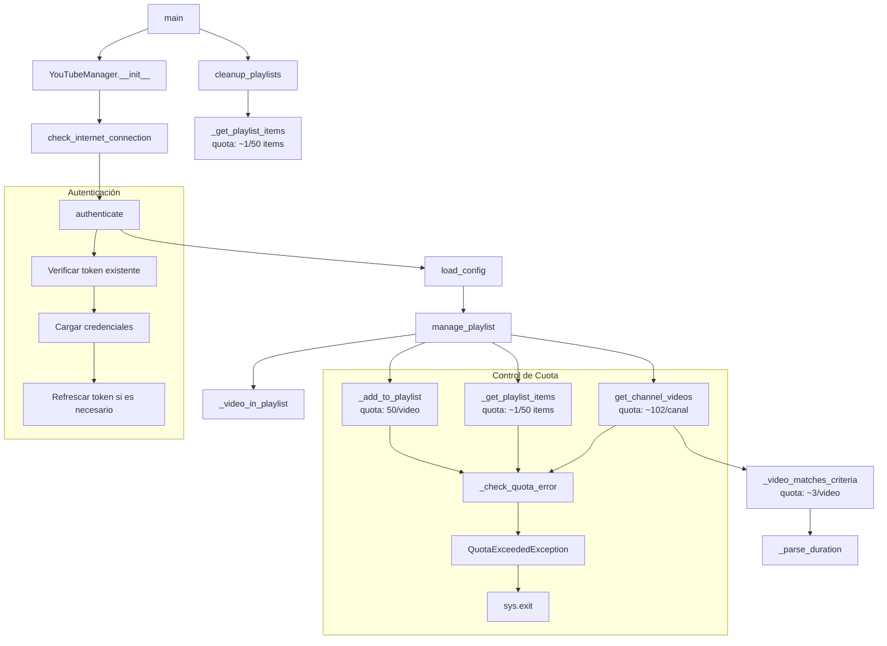

# YouTubeAutoList


[](https://github.com/hfsotomayor/YouTubeAutoList/releases)
[](https://github.com/hfsotomayor/YouTubeAutoList/issues)
[](https://github.com/hfsotomayor/YouTubeAutoList/pulls)
[](https://github.com/hfsotomayor/YouTubeAutoList/blob/main/LICENSE)

Sistema automatizado para gestionar listas de reproducción de YouTube basado en criterios configurables.

## Requisitos Previos

1. Python 3.11 o superior
2. Docker (opcional)
3.  Credenciales de YouTube API
4. Cuenta de Google y proyecto en Google Cloud Platform

## Configuración de Google Cloud Platform

1. Crear un nuevo proyecto en [Google Cloud Console](https://console.cloud.google.com/)
2. Habilitar YouTube Data API v3:
   - Ir a "APIs & Services" > "Library"
   - Buscar "YouTube Data API v3"
   - Clic en "Enable"

3. Configurar credenciales OAuth:
   - Ir a "APIs & Services" > "Credentials"
   - Clic en "Create Credentials" > "OAuth client ID"
   - Seleccionar "Desktop Application"
   - Configurar pantalla de consentimiento:
     * Tipo de usuario: Externo
     * Información de la aplicación
     * Permisos: `.../auth/youtube.force-ssl`
   - Descargar el archivo JSON de credenciales y renombrarlo a `YouTubeAutoListClientSecret.json`

## Configuración de Autenticación

1. **Revocar accesos previos** (importante para obtener refresh_token):
   - Ir a https://myaccount.google.com/permissions
   - Buscar "YouTubeAutoList"
   - Revocar acceso existente

2. **Generar nuevo token**:
```bash
python auth_setup.py
```

3. **Verificar el token generado**:
```bash
ls -l YouTubeAutoListToken.json
cat YouTubeAutoListToken.json | grep refresh_token
```

## Características

- Autenticación OAuth 2.0 con YouTube API
- Sistema de caché para optimizar las consultas a la API
- Filtrado de videos por duración y patrones en títulos
- Detección y exclusión automática de Shorts
- Limpieza automática de videos antiguos
- Soporte para múltiples canales y listas de reproducción
- Contenedorización con Docker

## Estructura

```
YouTubeAutoList/
├── YouTubeAutoList.py       # Script principal
├── auth_setup.py           # Script de autenticación inicial
├── entrypoint.sh          # Punto de entrada para Docker
├── Dockerfile             # Configuración de Docker
├── requirements.txt       # Dependencias Python
├── YouTubeAutoListConfig.json    # Configuración de canales
├── YouTubeAutoListToken.json     # Token de autenticación
└── YouTubeAutoListClientSecret.json  # Credenciales de Google Cloud
```

## Diagrama de Flujo 



### Consumo de Cuota por Canal

Para cada canal procesado, el consumo aproximado es:
- Búsqueda inicial: 100 unidades
- Detalles de videos: 1-2 unidades por video
- Verificación de playlist: 1 unidad por 50 videos
- Agregar video: 50 unidades por video
- Eliminar video: 50 unidades por video

El sistema de caché reduce el consumo total en aproximadamente un 80% al:
- Almacenar resultados de búsqueda por 1 hora
- Cachear contenidos de playlists por 2 horas
- Evitar consultas repetidas de videos ya procesados

**Nota**: La cuota diaria gratuita de YouTube API v3 es de 10,000 unidades.

## Configuración

### Archivo YouTubeAutoListConfig.json

```json
{
    "channels": [
        {
            "channel_id": "ID_CANAL",
            "channel_name": "Nombre Canal",
            "playlist_id": "ID_PLAYLIST",
            "playlist_name": "Nombre Playlist",
            "title_pattern": "regex_pattern",
            "min_duration": 120,
            "max_duration": 900,
            "hours_limit": 8
        }
    ]
}
```

## Expresiones Regulares en Configuración

Los patrones de búsqueda soportan:

1. **Palabras exactas**:
```json
"title_pattern": "(?i)(\\b(IA|AI|cars)\\b)"
```

2. **Palabras con sufijos**:
```json
"title_pattern": "\\b(bike|gravel|mtb)\\w*"
```

3. **Patrones específicos por canal**:
```json
{
    "channel_name": "Bike Sport",
    "title_pattern": "(?i)((Latest news bulletin.*Evening)|\\b(Gravel|MTB)\\b)"
}
```

4. **Formatos de fecha/hora**:
```json
{
    "channel_name": "TOUR FRANCE",
    "title_pattern": "(?i)(Noticias del \\d{4}/\\d{2}/\\d{2} 20h00)"
}
```

### Variables de Entorno Docker

```yaml
environment:
  - TZ=Europe/Madrid
  - CONFIG_DIR=/app/config
  - LOG_DIR=/app/logs
  - DATA_DIR=/app/data
```

## Uso

### Local

1. Instalar dependencias:
```bash
pip install -r requirements.txt
```

2. Ejecutar:
```bash
python YouTubeAutoList.py
```

### Docker 

Tener en cuenta que en el contexto que se ejecuta no permite volumenes ni docker compose.

1. Construir imagen:
```bash
docker build -t owner/youtubeautolist:tag . >> LogsBuild$(date "+%Y%m%d-%H%M%S").txt
```

2. Ejecutar:
```bash
docker run -d --name youtubeautolisttag --restart unless-stopped owner/youtubeautolist:tag .
```

## Logging

Los logs se guardan en:
- `logs/YouTubeAutoList.log`: Logs de la aplicación
- `logs/cron.log`: Logs de las ejecuciones programadas

## Commits Convencionales

Este proyecto sigue la especificación de [Commits Convencionales](https://www.conventionalcommits.org/es/v1.0.0/).

### Estructura del Commit

#### Tipos de Commits
- `feat`: Nueva característica
- `fix`: Corrección de errores
- `docs`: Cambios en documentación
- `style`: Cambios de formato (espacios, punto y coma, etc)
- `refactor`: Refactorización de código
- `perf`: Mejoras de rendimiento
- `test`: Añadir o modificar tests
- `build`: Cambios en el sistema de build
- `ci`: Cambios en integración continua
- `chore`: Tareas de mantenimiento

#### Ejemplos
```bash
feat(auth): implementar autenticación OAuth
fix(cache): corregir error en expiración de caché
docs(readme): actualizar diagrama de flujo
refactor(api): optimizar llamadas a YouTube API